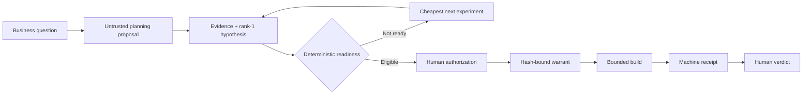

# TEMPO

[](https://github.com/vemodalen-x/TEMPO/actions/workflows/ci.yml)

**Stop coding agents from spending the build budget before the business case is
ready and a human has authorized the work.**

TEMPO is a Work & Productivity workflow for product and innovation leads who
supervise coding-agent work. It turns “should we build this?” into one of two
useful outcomes: the cheapest next experiment, or a bounded MVP charter that
can receive a separate human warrant. Research, finance, engineering, founders,
and agencies participate as secondary workflow roles.

This repository is a hackathon vertical slice, not a production authorization
service. It is local-first, dependency-light, and designed to be inspected by a
judge from a clean clone without credentials.

## Why it exists

Coding agents can make implementation fast enough that teams start building
before they agree on the decision, target user, evidence threshold, economics,
budget, deadline, or kill condition. That is a work-management problem, not
only a code-safety problem.

TEMPO moves the control boundary upstream:



A planning model may propose and summarize. Output entering through the
provider adapter is always normalized as model synthesis, so correctly labeled
model output and fixtures cannot satisfy the external-evidence gate, authorize
a build, manufacture a passing receipt, or fill the human verdict. TEMPO
validates declared provenance and freshness; this local slice does not
authenticate whether a user-supplied source record is genuine.

## What the demo proves

The one-command scenario shows the complete control boundary:

1. a model-shaped planning proposal is normalized as untrusted input;
2. insufficient evidence yields `EXPERIMENT_REQUIRED` with a concrete next
   action;
3. explicit fixture measurements satisfy the rank-1 hypothesis threshold and
   make the sample eligible for authorization;
4. implementation still stops because no warrant exists;
5. a demo-only, local-integrity warrant permits one in-scope start; and
6. protected charter drift invalidates that warrant.

The fixture is deliberately labeled. It proves the workflow, not market demand
or production-grade signing.

## Sample data

`samples/business-mvp/` contains the complete credential-free scenario:
opportunity and business-model records, one rank-1 hypothesis, a readiness
policy, initial/ready decision briefs, a charter proposal, a model-synthesis
fixture, supporting and contradictory interview fixtures, and a bounded task.
Every synthetic record says that it is a fixture. The demo copies these inputs
to an ignored workspace; it does not rewrite the checked-in samples.

## Setup

Prerequisites: Git and Python 3.10 or later. Runtime dependencies are from the
Python standard library; Docker is only needed to reproduce the isolated CI
profile.

Supported hosts are Windows, macOS, and Linux with Python 3.10+.

From a clean clone:

```bash
git clone https://github.com/vemodalen-x/TEMPO.git
cd TEMPO
python --version
python bin/tempo context
python bin/tempo selfcheck
```

The submission repository is public at
[github.com/vemodalen-x/TEMPO](https://github.com/vemodalen-x/TEMPO).

On systems where Python is installed as `python3`, substitute `python3` in the
commands. An editable install is optional:

```bash
python -m pip install -e .
tempo --help
```

## Run

Run the credential-free judge path:

```bash
python bin/tempo demo
```

Run the complete local verification and inspect the ledger:

```bash
python bin/tempo verify --level all
python bin/tempo ledger verify
```

Machine-readable output is available by placing global `--json` before the
command, for example `python bin/tempo --json demo`. The CLI uses stable exit
codes: `0` pass, `2` policy block, `3` checker failure, and `4` warning.

For the manual workflow and all options:

```bash
python bin/tempo --help
python bin/tempo business --help
python bin/tempo evidence --help
python bin/tempo mvp --help
```

Core commands cover business initialization/import/status, hypothesis and
evidence inspection, readiness assessment, charter creation/signing, warrant
authorization/revocation/status, gated MVP start, verdict compilation,
verification, and submission checks.

## Read the result

Human-readable commands use one order throughout:
**Outcome → Why → Evidence → Next action**. The two states that matter most are
kept separate:

- `MVP_AUTHORIZED` from readiness means *eligible for a human authorization
  decision*.
- `build_allowed: true` appears only after an independently valid warrant and
  start-gate check.

Generated artifacts live under `plan/`; the append-only ledger API, durable
head checkpoint, and receipts live under `.tempo/`. The checkpoint detects a
missing or truncated ledger tail, but remains local-integrity evidence rather
than an external notarization. JSON schemas live under `schemas/`.

## Architecture

| Layer | Responsibility | Authority |
| --- | --- | --- |
| Commercial planning provider | Propose normalized opportunity, model, hypotheses, and experiments | Suggestion only |
| Evidence/readiness kernel | Validate provenance and freshness, run blockers, score deterministically | Eligibility decision |
| Human warrant boundary | Bind signer, scope, budget, deadline, and protected hashes | Implementation authority |
| Start/guard layer | Revalidate authority for each declared task/action/lane | Allow or deny work |
| Ledger/verification/verdict | Preserve events, generate receipts, compile a human-owned memo | Evidence, not self-approval |

The code is intentionally vendor neutral. The current provider path normalizes
JSON fixtures and does not call the OpenAI API. See
[docs/openai-provider.md](docs/openai-provider.md) for the exact Codex/GPT-5.6
claim boundary.

## Work & Productivity fit

TEMPO is not presented as a generic developer guardrail. Its unit of value is a
faster, clearer team decision: research knows the evidence gap, product knows
the next experiment, finance sees the cap, engineering sees authorized scope,
and the business owner gets a reviewable verdict memo. No measured savings are
claimed in this release; time and avoided-cost impact remain hypotheses for a
real pilot.

See [docs/judging-alignment.md](docs/judging-alignment.md) for the official
criteria mapping and the explicit boundary between published guidance and
inferred OpenAI UX sensibilities.

The maintained recording plan is [demo/video-script.md](demo/video-script.md).

## Codex and GPT-5.6

Codex Desktop with GPT-5.6 in the user-selected Sol Ultra mode is the primary
build environment used to create and test this repository under `AGENTS.md`.
This is meaningful **build-time** model use, not a decorative label: GPT-5.6
materially contributed to source reconciliation, the readiness/authority
architecture, deterministic contracts, adversarial cases, the fixture journey,
and the submission narrative. The artifact-level map is recorded in
`submission/ai-usage.json`.

The submission must still use the exact session ID returned by `/feedback`;
`submission/session.json` currently contains only the candidate primary task
and requires that confirmation. The product runtime does not make a live
GPT-5.6 call, and the recorded commercial proposal fixture is not presented as
API evidence.

Codex accelerated four inspectable decisions in the primary build task:

- reconciled the supplied TEMPO specification, pinned VEMO mechanisms, and the
  earlier commercial-agent contract without copying private course content;
- identified the circularity between readiness and authorization and captured
  the two-stage resolution in ADR 0001;
- changed the product framing and config to Work & Productivity after the owner
  selected that track, captured in ADR 0002; and
- implemented the vertical slice and adversarial conformance cases in parallel,
  then used executable checks instead of narrative completion claims.

### What is new for Build Week

The standalone repository, schemas, deterministic readiness kernel, warrant
boundary, ledger/receipts, fixture demo, tests, and submission package were
created during the 2026 Build Week submission period. The TEMPO v1.3 archive,
VEMO repository, and earlier commercial workflow predate this entry and are
credited as design sources. Source pins and the adaptation boundary are
recorded in `MANIFEST.json`, `THIRD_PARTY_NOTICES.md`, and
`docs/source-analysis/`.

## Security and verification

Start with [SECURITY.md](SECURITY.md) and
[SANDBOX_CONTRACT.md](SANDBOX_CONTRACT.md). Local runs provide deterministic
checks and local integrity, not hostile-code isolation. CI adds a digest-pinned,
unprivileged, network-disabled container profile. Receipts record which profile
actually ran.

If Docker or Podman is available, reproduce that profile with
`python bin/tempo verify --level all --require-container`. Missing container
tooling is a checker failure, never a simulated pass.

Requirement-to-code-to-proof links are in
[TRACEABILITY.md](TRACEABILITY.md). Third-party lineage and licenses are in
`THIRD_PARTY_NOTICES.md` and `LICENSE`.

## Submission status

This project has not been deployed, uploaded as a video, or submitted to
Devpost. The public repository, clean-clone journey, and cross-platform CI are
verified. Public YouTube URL, `/feedback` confirmation, and final owner review
remain explicit blockers in
[submission/checklist.md](submission/checklist.md).
